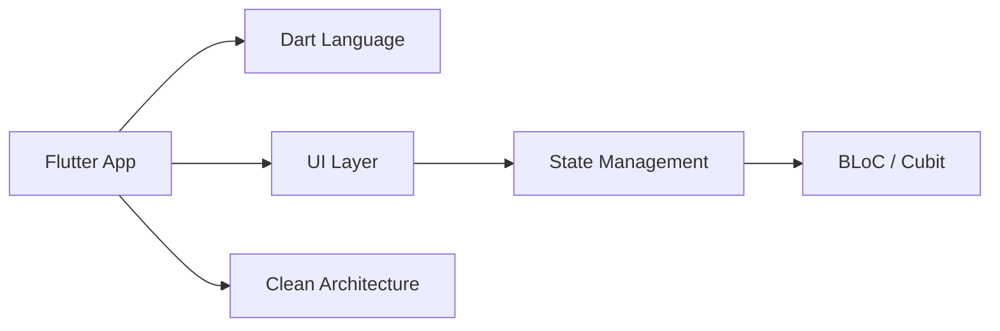
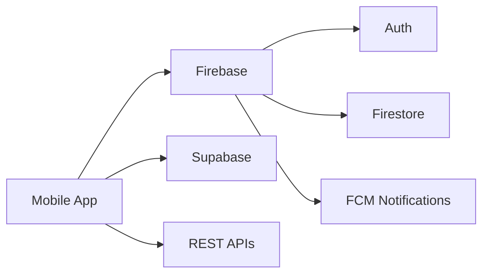
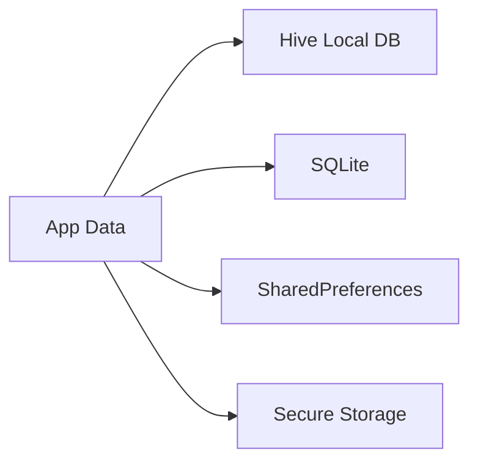
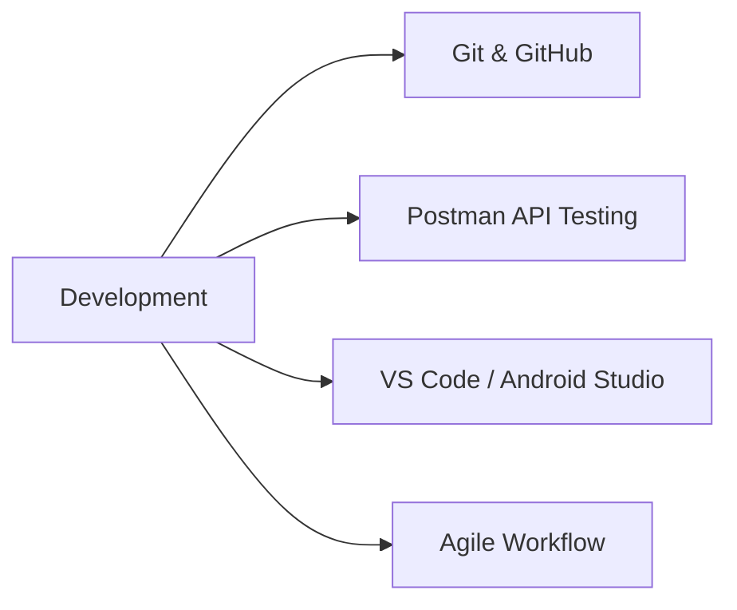

# 👋 Mohamed Ali — Flutter Developer

> 🚀 Crafting high-performance cross-platform mobile apps with Flutter
> 📍 Egypt

---

## 🧠 About Me

I'm a **Flutter Developer** specialized in building scalable, production-ready mobile applications.

I focus on:

* Clean Architecture
* High performance
* Maintainable codebases
* Real-world scalable systems

I enjoy turning complex problems into simple, elegant solutions.

---

## ⚡ Tech Stack (System Flow Architecture)

> Visual representation of how my development ecosystem is structured 🚀

---

### 📱 Mobile Layer

---

### 🔥 Backend & APIs Layer

---

### 💾 Data Storage Layer

---

### 🛠 Tools & Workflow

---

## 🚀 What I Build

* Scalable Mobile Applications
* E-commerce Apps
* Booking Systems
* POS & Invoice Systems
* Educational Platforms
* Real-time Apps

---

## 📊 GitHub Stats

> ⚠️ Replace `Mohamedali0219` with your GitHub username

---

## 🧩 Development Philosophy

> "Write code that your future self can understand without pain."

* Clean Code over quick hacks
* Structure over randomness
* Scalability over shortcuts

---

## 📫 Contact Me

* LinkedIn: [https://linkedin.com/in/mohamed-ali-khamis](https://linkedin.com/in/mohamed-ali-khamis)
* Email: [mohamedali.d2002@gmail.com](mailto:mohamedali.d2002@gmail.com)

---
