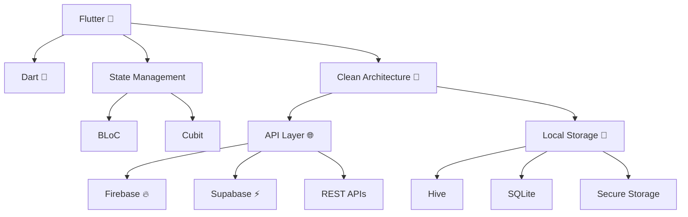

<!-- HERO ANIMATION -->

<p align="center">
  
</p>

<p align="center">
  
  
  
  
</p>

---

## 🧠 About Me

```yaml
name: Mohamed Ali
title: Flutter Developer
location: Egypt
focus: "Scalable Mobile Apps & Clean Architecture"
passion: "Turning ideas into real products"
```

---

## ⚡ Tech Stack (Visual)



---

## 🚀 What I Build

✨ Mobile Applications
✨ E-commerce Platforms
✨ Booking Systems
✨ POS & Invoice Apps
✨ Real-time Applications

---

## 🧩 Development Philosophy

<p align="center">
  
</p>

> Clean code is not written by chance — it is engineered.

---

## 📊 GitHub Stats

<p align="center">
  
</p>

<p align="center">
  
</p>

---

## 🐍 Contribution Snake

<p align="center">
  
</p>

---

## 📫 Contact Me

<p align="center">
  <a href="https://linkedin.com/in/mohamed-ali-khamis">
    
  </a>
  <a href="mailto:mohamedali.d2002@gmail.com">
    
  </a>
</p>

---

<p align="center">
  🚀 Built with passion by Mohamed Ali
</p>
