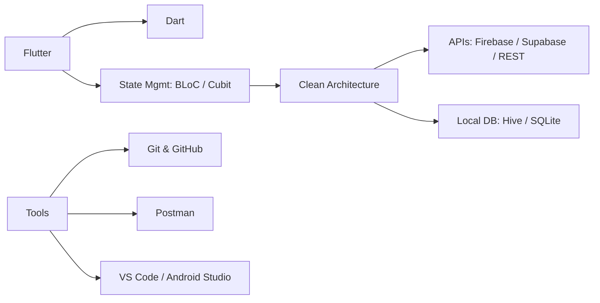

# 👋 Mohamed Ali — Flutter Developer

> 🚀 Flutter Developer | Cross-Platform Mobile Engineer
> 📍 Egypt

---

## 🧠 About Me

Flutter Developer focused on building **scalable, clean, and high-performance mobile applications**.

I specialize in turning complex ideas into simple, production-ready solutions.

---

## ⚡ Tech Stack

---

## 🚀 What I Build

* Scalable Mobile Apps
* E-commerce Applications
* Booking Systems
* POS & Invoice Systems
* Real-time Apps

---

## 🧩 Core Strengths

* Clean Architecture
* SOLID Principles
* Performance Optimization
* Reusable Code Design
* API Integration

---

## 📊 GitHub Stats

---

## 📫 Contact

* LinkedIn: [https://linkedin.com/in/mohamed-ali-khamis](https://linkedin.com/in/mohamed-ali-khamis)
* Email: [mohamedali.d2002@gmail.com](mailto:mohamedali.d2002@gmail.com)

---

> 💡 "Clean code is not written by chance, it is designed."
